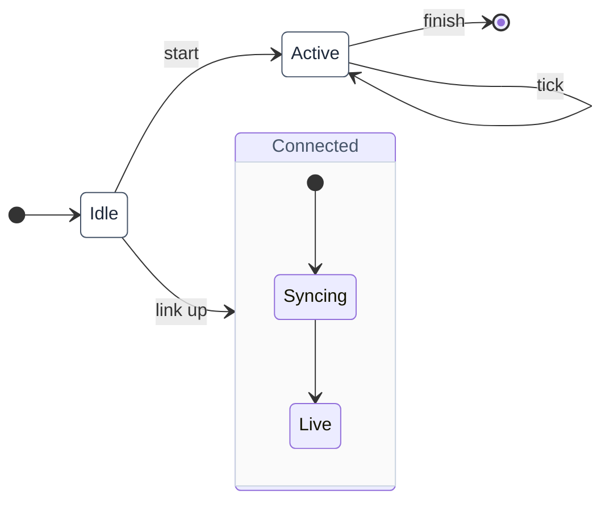

# State machines

State machines are supported in **all three formats** — D2, Mermaid, and
PlantUML — sharing **one colour vocabulary** generated from `tokens.json`
(`state_machine` block) by `build-style.py`. What differs is the *grammar*:

- **D2 has no native state-machine grammar**, so a state machine is a general
  graph that *reads* as one because a small convention is applied every time.
  That convention lives in the generated `state-machine.d2` (importable classes).
- **Mermaid (`stateDiagram-v2`) and PlantUML (`state`) have native grammars.**
  `[*]` draws the initial and final pseudostates for you; you don't need a
  convention file, only the house **colours**, which are generated into
  `palette.mmd` (Mermaid `classDef`) and `palette.puml` (PlantUML `<style>`
  stereotypes).

So there is a `state-machine.d2` but no `state-machine.mmd`/`.puml`: those tools
have the grammar built in and take colour from their palette. Editing the
`state_machine` block in `tokens.json` and re-running `build-style.py` recolours
state machines in every tool at once.

## The shared vocabulary

| Role | Models | D2 (`...@state-machine`) | Mermaid (`stateDiagram-v2`) | PlantUML (`state`) |
|---|---|---|---|---|
| `start` | initial pseudostate | `i: "" { class: start }` (solid dot) | `[*] -->` (native) | `[*] -->` (native) |
| `final` | final state | `done: "" { class: final }` (ring dot) | `--> [*]` (native) | `--> [*]` (native) |
| `state` | a normal state | `S { class: state }` | `class S state` | `state "S" as S <<state>>` |
| `choice` | a branch / choice | `c: "" { class: choice }` (diamond) | `state c <<choice>>` (native) + `class c choice` | `state c <<choice>>` |
| `composite` | a state with a nested machine | `C { class: composite … }` | `state C { … }` (native) | `state C { … }` (native) |

Colour is identical across tools (all from `tokens.json`). `start`/`final` are
D2-only *styling* — in Mermaid and PlantUML write `[*]` and the tool renders
those pseudostates itself.

## D2 — the convention

D2 has no state grammar, so spread the generated state-machine classes in
alongside the house style and tag nodes:

```d2
...@style
...@state-machine
direction: right

i:      "" { class: start }       # initial pseudostate — a solid dot, no label
idle:   Idle    { class: state }
active: Active  { class: state }
done:   "" { class: final }       # final state — dot with a ring

i      -> idle
idle   -> active: start
active -> done:   finish
active -> active: tick            # self-transition
```

Give a `start` node an **empty label** so it renders as a bare dot. When a
machine has several distinct outcomes, label each `final` with its name
(`done: COMPLETED { class: final }`) so a reviewer can tell the terminals apart.

**Transitions** carry the trigger, and where it matters the guard and action, in
the usual `event [guard] / action` shape:

```d2
active -> check?:  submit
check? -> active:  "rejected [attempts < 3] / increment"
check? -> blocked: "rejected [attempts == 3]"
```

**Choice / action points.** Use a `choice` diamond where an event reaches a
branch. If the branch also *acts*, keep the diamond and put the action on the
**outgoing edges** — do not invent a separate action shape.

**Wait / pause states.** A state that pauses pending an external reply is an
ordinary `state`; label the edge in with what triggered the pause and the edge
out with what the external party did.

**From-any-state transitions** (withdraw, cancel, reset) are the ubiquitous-edge
hairball: wrap the sources in a `composite` region and draw a **single** edge
from the container boundary, stating the convention in a `caption`.

**Composite states** are a container tagged `composite`; inner states nest
normally with their own `start`. Classes spread in at the root are visible
inside containers:

```d2
connected: Connected { class: composite
  ci: "" { class: start }
  syncing: Syncing { class: state }
  live:    Live    { class: state }
  ci -> syncing -> live
}
disconnected: Disconnected { class: state }
disconnected -> connected: link up
connected    -> disconnected: drop
```

## Mermaid — `stateDiagram-v2`

Mermaid has the grammar natively. Use `[*]` for initial/final, nest composite
states with `state Name { … }`, and pull the house colours by pasting the
`state`/`choice`/`composite` `classDef` lines from `palette.mmd` (or render with
`mmdc -C palette.css` and skip the paste), then `class <State> <role>`:



Branch points use a native choice pseudostate (`state c <<choice>>`), coloured
with `class c choice`.

## PlantUML — `state`

PlantUML also has the grammar natively. `!include palette.puml` for the house
colours, declare states with the matching `<<stereotype>>`, and use `[*]` for
initial/final:

```plantuml
@startuml
!include palette.puml

state "Idle" as Idle <<state>>
state "Active" as Active <<state>>
state "Connected" as Connected <<composite>> {
  [*] --> Syncing
  Syncing --> Live
}

[*] --> Idle
Idle --> Active : start
Active --> Active : tick
Active --> [*] : finish
Idle --> Connected : link up
@enduml
```

A choice pseudostate is `state c <<choice>>`; put the action on the outgoing
transitions, as in D2.

## When to leave the house convention

This covers ordinary state charts well in any of the three tools. If you
genuinely need formal semantics — orthogonal (concurrent) regions, history
pseudostates, exact entry/exit actions — PlantUML and Mermaid model more of that
natively than D2 does; reach for whichever expresses it directly rather than
forcing the D2 graph convention. Most diagrams labelled "state machine" are not
that, and are better served staying in the format the rest of the pattern's
diagrams use.

**Informal concurrency.** To show that *two things happen within one state*
without claiming formal concurrency, approximate it with a branch that fans out
and merges back to the same exit, and name it as such in review so no one
mistakes the branch+merge for a real parallel region.
